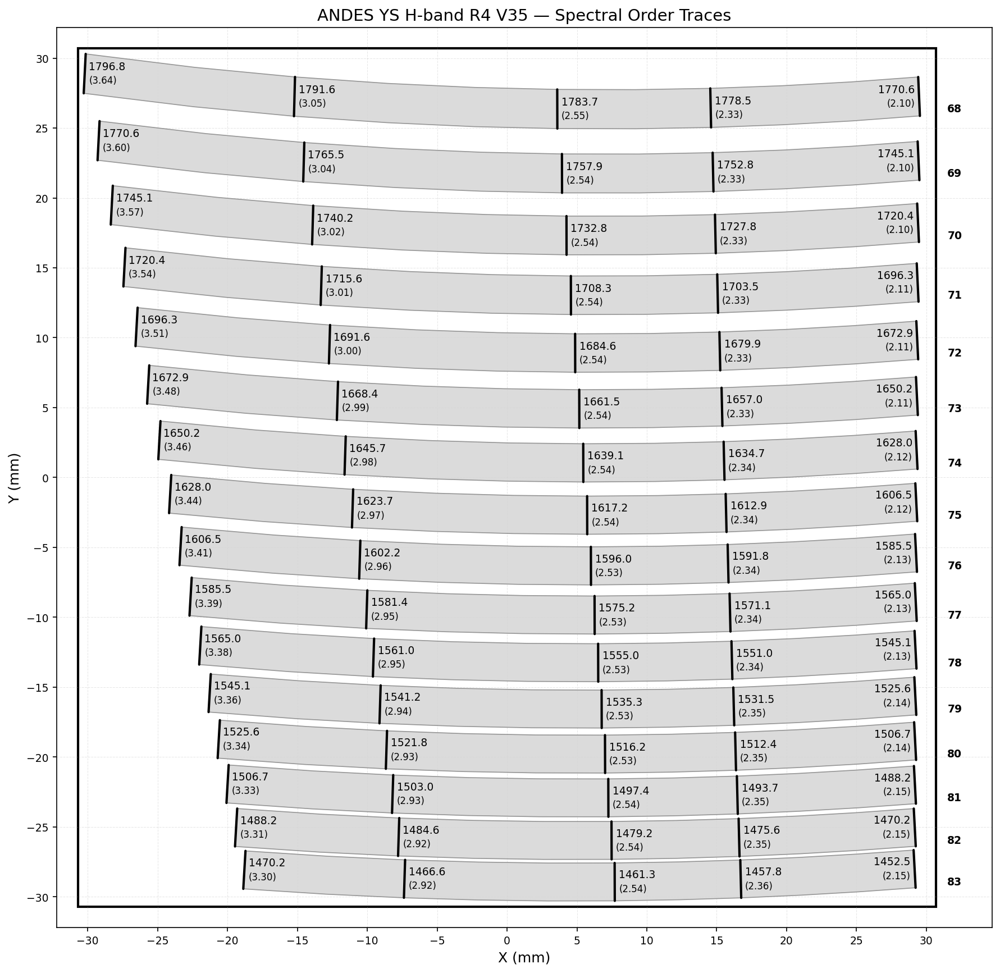
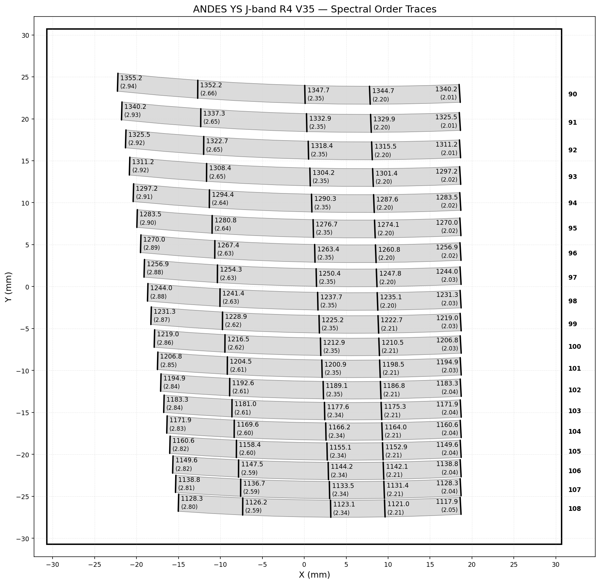
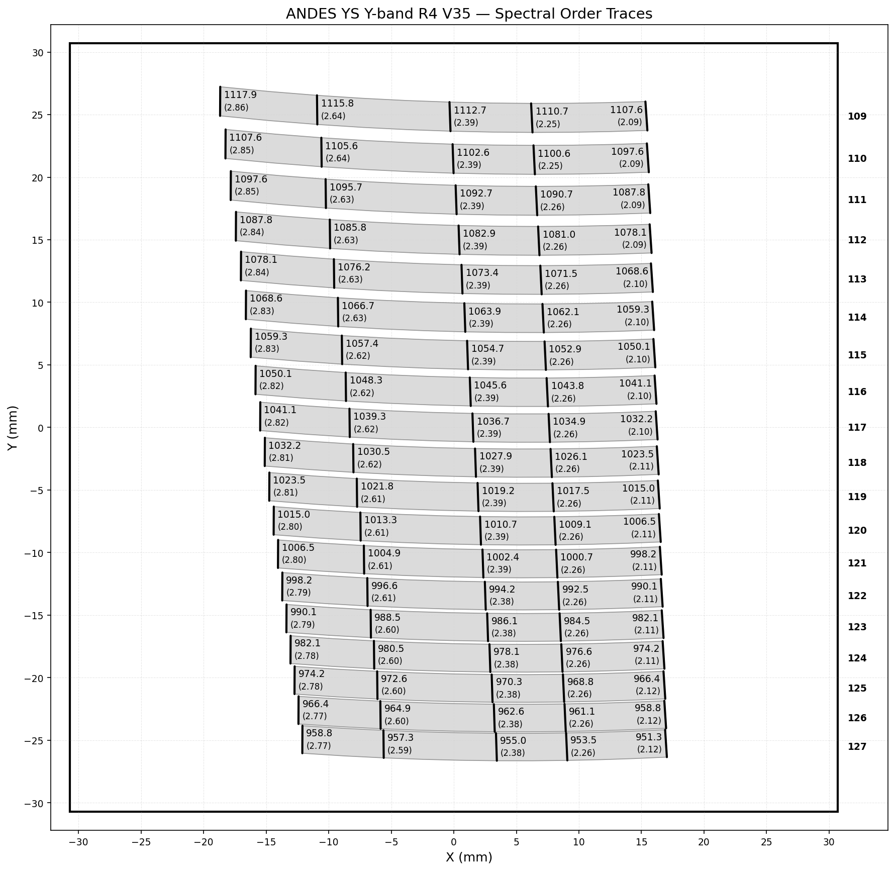

# ANDES Order Mapping

Visualization tool for spectral order traces of the ANDES spectrograph (R4 grating, V35 configuration). Supports H, J, and Y bands.

## Description

`spectral_order_plotting.py` parses an order mapping file that defines the position and geometry of echelle spectral orders on a detector focal plane. Each order is represented as a filled polygon bounded by its upper and lower slit edges, and the plot shows how the orders are distributed across the detector surface.

The script produces a plot with:
- **Filled order traces** showing the physical footprint of each spectral order on the detector
- **Order numbers** labeled to the right of the detector boundary
- **Slit lines** drawn as bold lines at 5 evenly spaced positions along each order
- **Wavelength labels** (nm) and **slit width in pixels** beside each slit line
- **Detector boundary** drawn as a 30.7 mm × 30.7 mm square
- **X/Y tick marks** in mm

## Input File Format

The order mapping file is a tab-separated text file with the following columns:

| Column | Description |
|--------|-------------|
| `ORDER` | Echelle order number |
| `Wavelength (nm)` | Wavelength at this position |
| `X0`, `Y0` | Center trace coordinates (mm) |
| `X1`, `Y1` | Lower edge coordinates (mm) |
| `X2`, `Y2` | Upper edge coordinates (mm) |
| `Sampling (pixels)` | Slit width at the detector plane (pixels) |

Each order contains multiple rows sampling the trace along the dispersion direction. The filled polygon for each order is constructed from the lower edge (`X1`, `Y1`) and upper edge (`X2`, `Y2`) coordinate sequences.

## Usage

Pass the input file as a command-line argument:

```bash
python spectral_order_plotting.py ANDES_YS_H_R4_V35_orders.txt
python spectral_order_plotting.py ANDES_YS_J_R4_V35_orders.txt
python spectral_order_plotting.py ANDES_YS_Y_R4_V35_orders.txt
```

The plot title and output filename are derived automatically from the input filename (e.g., `order_map_H.png`). The plot is also displayed interactively.

## Dependencies

```bash
pip install numpy matplotlib pandas
```

## Available Data Files

| File | Band | Orders | Wavelength range |
|------|------|--------|-----------------|
| `ANDES_YS_H_R4_V35_orders.txt` | H | 68–83 | ~1452–1796 nm |
| `ANDES_YS_J_R4_V35_orders.txt` | J | 90–108 | ~1117–1355 nm |
| `ANDES_YS_Y_R4_V35_orders.txt` | Y | 109–127 | ~951–1118 nm |

## Output

### H Band (orders 68–83, ~1452–1796 nm)


### J Band (orders 90–108, ~1117–1355 nm)


### Y Band (orders 109–127, ~951–1118 nm)

