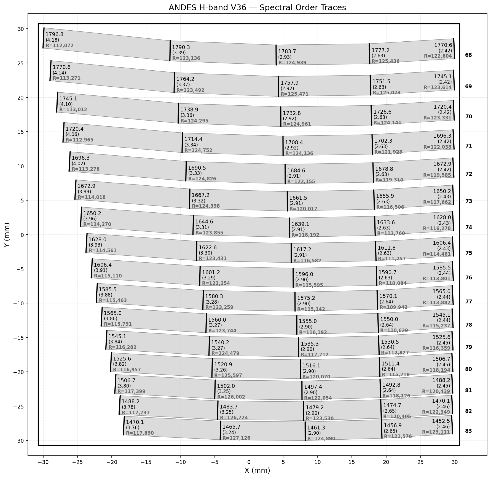

# ANDES Order Mapping

End-to-end pipeline for generating and visualizing spectral order maps of the [ANDES](https://andes.inaf.it/) spectrograph — from Zemax optical simulation to publication-ready detector footprint plots with wavelength, sampling, and resolution annotations.

## Pipeline overview

```
┌─────────────────────────────────┐
│        ANDES_IMA.ZPL            │
│   (Zemax OpticStudio macro)     │
└────────────────┬────────────────┘
                 │
        ┌────────┴────────┐
        ▼                 ▼
  slit image files   XY data file
R{order}{step}.txt  ANDES_V36_H_XY.txt
  (GIA output)     (PRINT output, 9 cols)
        │                 │
        └────────┬────────┘
                 ▼
  ┌──────────────────────────────┐
  │    add_fwhm_resolution.py    │
  │  (Gaussian LSF fit + R calc) │
  └──────────────┬───────────────┘
                 │
     ANDES_V36_H_XY.txt (12 cols)
     + FWHM (px), R_geo, R_fwhm
                 │
                 ▼
  ┌──────────────────────────────┐
  │  spectral_order_plotting.py  │
  │   (detector footprint plot)  │
  └──────────────┬───────────────┘
                 │
        V36_sampling_Hband.png
```

---

## Step 1 — Generate data with ANDES_IMA.ZPL

### What the macro does

`ANDES_IMA.ZPL` is a Zemax OpticStudio ZPL macro that iterates over all echelle orders of a selected band. For each order it steps through `n_step` wavelengths covering the free spectral range and, at each step:

1. Sets the echelle grating order and wavelength in the optical model
2. Traces four chief rays to locate the slit footprint on the detector:
   - slit center `(x0, y0)`
   - slit bottom edge `(x1, y1)`
   - slit top edge `(x2, y2)`
   - slit left/right lateral edges `(xl, xr)` at ±0.013352 field units
3. Computes the **geometric slit width in detector pixels**: `dx = (xl − xr) / 0.015 mm`
4. Runs **Geometric Image Analysis** (GIA) and saves the slit image histogram as `R{order}{step}.txt`
5. Prints one data row to stdout: `order  λ(nm)  x0  y0  x1  y1  x2  y2  dx`

### Grating parameters

| Parameter | Value |
|-----------|-------|
| Groove density | 16 lines/mm |
| Blaze angle | 76° |
| H-band orders | 68–83 |
| J-band orders | 90–108 |
| Y-band orders | 109–127 |
| Steps per order (`n_step`) | 5 |
| Detector pixel size | 15 µm |

### Running the macro

1. Open the `.zos` optical model in OpticStudio
2. Edit `ANDES_IMA.ZPL` and update:
   - `starting_order` / `end_order` for the target band
   - `settingFile$` — path to the `.CFG` file for the GIA tool
   - The output directory in the `filename$` construction line
3. Open the macro editor (**Tools → Macros → Edit/Run ZPL**), load `ANDES_IMA.ZPL`, and run
4. Redirect the PRINT output to the XY data file (e.g. `ANDES_V36_H_XY.txt`)

The slit image files (`R{order}{step}.txt`) are saved directly to the directory set in the macro.

### Output format

**XY data file** — one row per (order, step), space-separated:

| Col | Name | Unit | Description |
|-----|------|------|-------------|
| 1 | ORDER | — | Echelle order number |
| 2 | Wavelength | nm | Central wavelength at this step |
| 3–4 | X0, Y0 | mm | Slit centre on detector |
| 5–6 | X1, Y1 | mm | Slit bottom edge |
| 7–8 | X2, Y2 | mm | Slit top edge |
| 9 | Geo. sampling | px | Geometric slit width in detector pixels |

**Slit image files** — Zemax GIA histogram listings, one per (order, step). The grid is square (50×50 for H-band), tab-separated, with a multi-line header followed by the intensity array. File naming: `R{order}{step}.txt` (e.g. `R681.txt` = order 68, step 1).

---

## Step 2 — Compute FWHM and spectral resolution (add_fwhm_resolution.py)

### What it does

For each slit image file in the data directory the script:

1. Loads the 2-D intensity grid (auto-detects grid size — works for 25×25 and 50×50)
2. Collapses along the spatial axis to obtain a 1-D **Line Spread Function (LSF)**
3. Fits a Gaussian to the LSF and converts σ → **FWHM in sensor pixels**  
   `FWHM_px = 2√(2 ln 2) × σ × (slit image pitch / pixel size) = σ × 0.005 / 0.015`
4. Reads the XY file, assigning field index by row order within each echelle order group
5. Computes spectral **dispersion** dλ/dX (nm/mm) via `numpy.gradient` on (λ, X0)
6. Computes spectral resolution for each row:
   - `R_geo  = round(λ / (geo_sampling × 0.015 × |dλ/dX|))`
   - `R_fwhm = round(λ / (FWHM_px   × 0.015 × |dλ/dX|))`
7. Saves a backup of the XY file, then overwrites it with three appended columns

### Physical parameters

| Parameter | Value |
|-----------|-------|
| Slit image grid pitch | 5 µm (0.005 mm/px) |
| Detector pixel size | 15 µm (0.015 mm/px) |

### Usage

```bash
python add_fwhm_resolution.py <slit_image_dir> <xy_file>
```

Example:
```bash
python add_fwhm_resolution.py data/ ANDES_V36_H_XY.txt
```

Both arguments are optional and default to the paths used during development.

### Output

The XY file is updated **in place**. A backup (`_backup.txt`) is saved first.
Three columns are appended:

| Col | Name | Description |
|-----|------|-------------|
| 10 | FWHM | Gaussian LSF FWHM (sensor pixels) |
| 11 | R_geo | Spectral resolution from geometric slit width |
| 12 | R_fwhm | Spectral resolution from slit image FWHM |

---

## Step 3 — Plot the spectral order map (spectral_order_plotting.py)

### What it does

Reads the enriched XY file and renders a scaled detector footprint where each spectral order appears as a filled polygon bounded by its slit edges. At 5 evenly spaced positions along each order, a bold slit-line is drawn with:
- **Wavelength** (nm)
- **Geometric sampling** (pixels, in parentheses)
- **Spectral resolution R** (from FWHM when available, otherwise computed on the fly)

The rightmost annotation per order is placed to the **left** of its slit mark to prevent overflow at the detector edge.

### Usage

```bash
# Default: reads ANDES_V36_H_XY.txt
python spectral_order_plotting.py

# Explicit path
python spectral_order_plotting.py /path/to/ANDES_V36_H_XY.txt

# Multi-band Excel workbook
python spectral_order_plotting.py ANDES_V36_YJH.xlsx --band H

# Suppress R annotations
python spectral_order_plotting.py ANDES_V36_H_XY.txt --no-resolution

# Wavelength labels only, rotated along the trace
python spectral_order_plotting.py ANDES_V36_H_XY.txt --wavelength-only
```

### Input format auto-detection

| Columns | Interpretation |
|---------|---------------|
| 9 | Original XY data — R is computed on the fly from geo sampling + dispersion |
| 12 | Enriched data — pre-computed FWHM and R are used directly |
| Excel | Sheet selected with `--band H/J/Y` |

### Output filename

Derived automatically from the input: `ANDES_V36_H_XY.txt` → `V36_sampling_Hband.png`.

---

## H-band result (V36 design)



16 orders (68–83), 1452–1796 nm, 5 sample points per order.  
Each annotation shows wavelength (nm), geometric sampling (px), and resolution R.

---

## Dependencies

```bash
pip install numpy scipy matplotlib pandas openpyxl
```

Requires **Zemax OpticStudio** to run `ANDES_IMA.ZPL`.

## Repository contents

| File | Description |
|------|-------------|
| `ANDES_IMA.ZPL` | Zemax macro — ray tracing + GIA |
| `add_fwhm_resolution.py` | Gaussian LSF fit + resolution computation |
| `spectral_order_plotting.py` | Detector footprint visualisation |
| `ANDES_V36_H_XY.txt` | H-band V36 enriched XY data (12 columns) |
| `V36_sampling_Hband.png` | H-band V36 order map |
