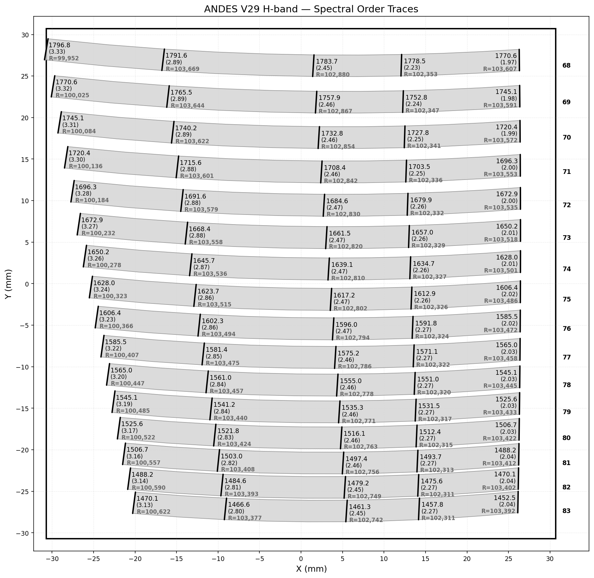
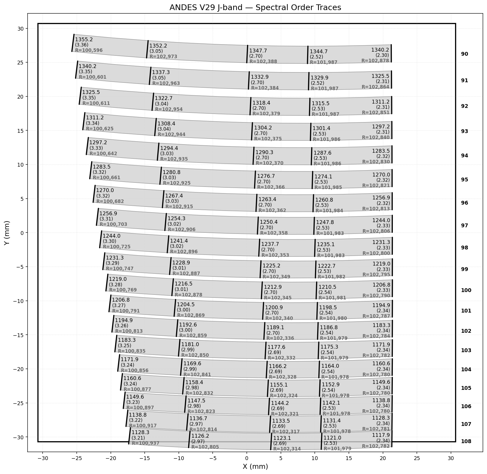
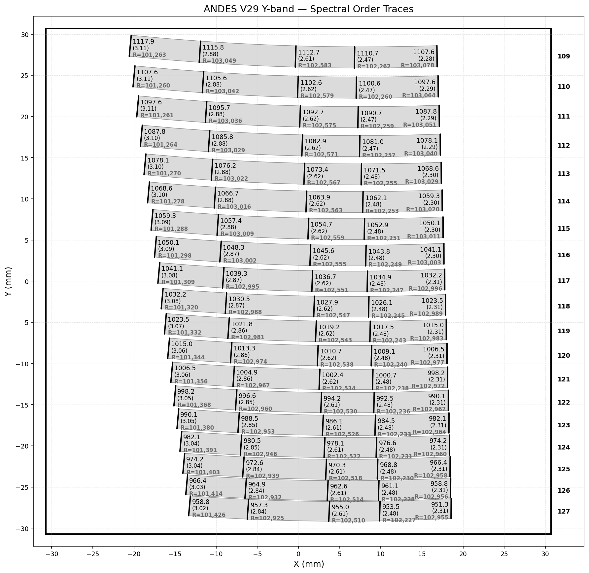
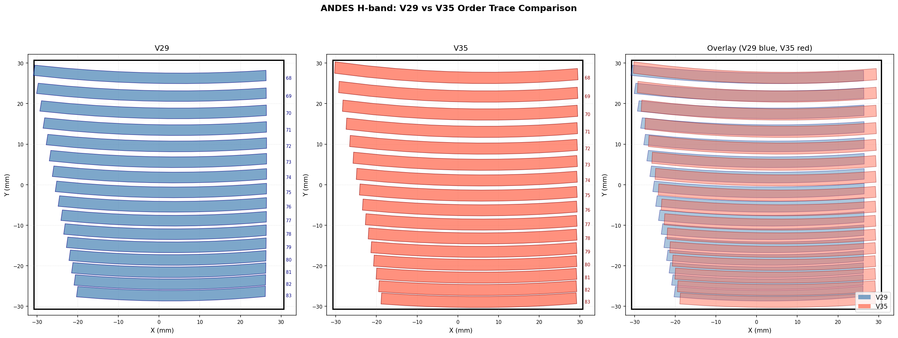
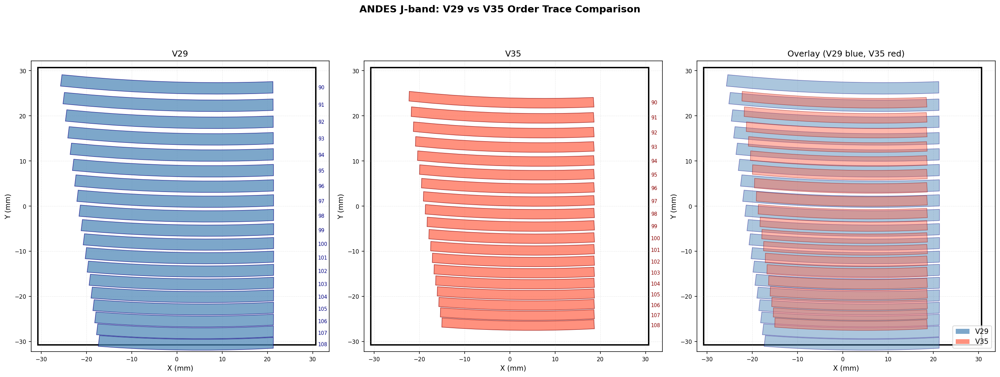
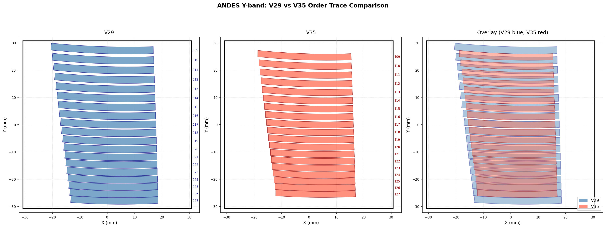

# ANDES Order Mapping

Visualization tool for spectral order traces of the ANDES spectrograph. Supports H, J, and Y bands across multiple grating configurations (V29, V35).

## Description

`spectral_order_plotting.py` parses an order mapping file that defines the position and geometry of echelle spectral orders on a detector focal plane. Each order is represented as a filled polygon bounded by its upper and lower slit edges, and the plot shows how the orders are distributed across the detector surface.

The script produces a plot with:
- **Filled order traces** showing the physical footprint of each spectral order on the detector
- **Order numbers** labeled to the right of the detector boundary
- **Slit lines** drawn as bold lines at 5 evenly spaced positions along each order
- **Wavelength labels** (nm) beside each slit line, with the number in parentheses below indicating the geometric sampling in pixels for a 15 µm pixel size
- **Detector boundary** drawn as a 30.7 mm × 30.7 mm square
- **X/Y tick marks** in mm

`compare_versions.py` generates side-by-side and overlay comparison plots between two grating configurations for each band.

## Input File Format

The order mapping file is a tab-separated text file with the following columns:

| Column | Description |
|--------|-------------|
| `ORDER` | Echelle order number |
| `Wavelength (nm)` | Wavelength at this position |
| `X0`, `Y0` | Center trace coordinates (mm) |
| `X1`, `Y1` | Lower edge coordinates (mm) |
| `X2`, `Y2` | Upper edge coordinates (mm) |
| `Sampling (pixels)` | Slit width at the detector plane (pixels) |
| `R` | Spectral resolution |

Each order contains multiple rows sampling the trace along the dispersion direction. The filled polygon for each order is constructed from the lower edge (`X1`, `Y1`) and upper edge (`X2`, `Y2`) coordinate sequences.

## Usage

Pass the input file as a command-line argument:

```bash
python spectral_order_plotting.py ANDES_YS_H_R4_V35_orders.txt
python spectral_order_plotting.py ANDES_V29_Hband_orders.txt
```

The plot title and output filename are derived automatically from the input filename. The plot is also displayed interactively.

To generate V29 vs V35 comparison plots for all bands:

```bash
python compare_versions.py
```

## Dependencies

```bash
pip install numpy matplotlib pandas
```

## Available Data Files

### V35 configuration (R4 grating)

| File | Band | Orders | Wavelength range |
|------|------|--------|-----------------|
| `ANDES_YS_H_R4_V35_orders.txt` | H | 68–83 | ~1452–1796 nm |
| `ANDES_YS_J_R4_V35_orders.txt` | J | 90–108 | ~1117–1355 nm |
| `ANDES_YS_Y_R4_V35_orders.txt` | Y | 109–127 | ~951–1118 nm |

### V29 configuration

| File | Band | Orders | Wavelength range |
|------|------|--------|-----------------|
| `ANDES_V29_Hband_orders.txt` | H | 68–83 | ~1452–1796 nm |
| `ANDES_V29_Jband_orders.txt` | J | 90–108 | ~1117–1355 nm |
| `ANDES_V29_Yband_orders.txt` | Y | 109–127 | ~951–1118 nm |

## V29 vs V35 Comparison Summary

Order trace centroid shifts (V35 − V29):

| Band | dX mean (mm) | dY mean (mm) | dX range (mm) | dY range (mm) |
|------|-------------|-------------|--------------|--------------|
| H | +2.108 | −0.790 | [+2.017, +2.207] | [−1.611, +0.261] |
| J | −0.126 | +0.688 | [−0.349, +0.135] | [−3.350, +4.161] |
| Y | −0.111 | +0.130 | [−0.285, +0.092] | [−2.467, +2.394] |

The H-band shows a consistent ~2.1 mm shift in X between V29 and V35. The J and Y bands show larger spread in Y (up to ~4 mm), with near-zero mean X offset.

## Output

### V35 — H Band (orders 68–83, ~1452–1796 nm)


### V35 — J Band (orders 90–108, ~1117–1355 nm)


### V35 — Y Band (orders 109–127, ~951–1118 nm)


### V29 — H Band


### V29 — J Band


### V29 — Y Band


### Comparisons (V29 blue, V35 red)

#### H Band


#### J Band


#### Y Band

